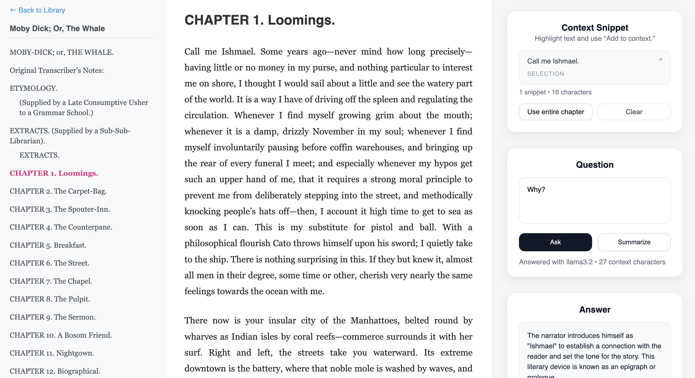

# reader



From Karpathy: *"A lightweight, self-hosted EPUB reader that lets you read through EPUB books one chapter at a time. This makes it very easy to copy paste the contents of a chapter to an LLM, to read along. Basically - get epub books (e.g. [Project Gutenberg](https://www.gutenberg.org/) has many), open them up in this reader, copy paste text around to your favorite LLM, and read together and along. This project was 90% vibe coded just to illustrate how one can very easily [read books together with LLMs](https://x.com/karpathy/status/1990577951671509438)."*

## Usage

The project uses [uv](https://docs.astral.sh/uv/). So for example, download [Moby Dick EPUB3](https://www.gutenberg.org/ebooks/2701) to this directory as `moby_dick.epub`, then:

```bash
uv run reader3.py moby_dick.epub
```

This creates the directory `moby_dick_data`, which registers the book to your local library. We can then run the server:

```bash
uv run server.py
```

And visit [localhost:8123](http://localhost:8123/) to see your current Library. You can easily add more books, or delete them from your library by deleting the folder.

## Built-in LLM assistant

You can now highlight passages and talk to a lightweight local LLM without leaving the reader.

1. Install and start [Ollama](https://ollama.com/) (or another compatible server) locally, e.g.:
   ```bash
   ollama serve &
   ollama run llama3.2
   ```
2. (Optional) Point the reader to a different host/model:
   ```bash
   export OLLAMA_HOST="http://localhost:11434"
   export OLLAMA_MODEL="llama3.2"
   ```
3. Open a chapter, highlight any text, click **Add to context**, type a question, and press **Ask question**.  
   Use **Summarize section** to get a quick recap; if no snippets are selected, the whole chapter is used.

Context is truncated to ~8k characters before sending to the model. If you run a different LLM gateway, adapt the `/api/llm/query` handler in `server.py`.

### Troubleshooting tips

- After pulling new changes, always restart the FastAPI server so the `/api/llm/query` route is available:
  ```bash
  uv sync   # installs httpx the first time
  uv run server.py
  ```
- If the assistant UI shows “Not Found”, it means the server you’re talking to doesn’t have that endpoint. Restart the server and reload the browser tab.
- To confirm the API is alive, run:
  ```bash
  curl -X POST http://127.0.0.1:8123/api/llm/query \
       -H 'Content-Type: application/json' \
       -d '{"book_id":"Book_data","chapter_index":0,"question":"test","context":"hello"}'
  ```
  You should get a JSON answer instead of HTML. Once this works, the in-app assistant will work too.

## License

MIT
